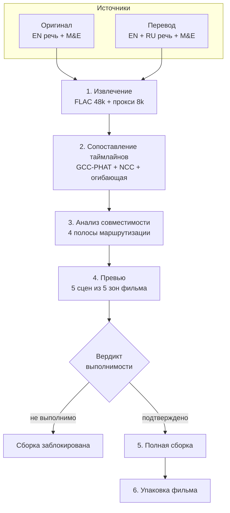

# Конвейер DubClean: полная логика обработки

Документ описывает, что происходит с фильмом от момента добавления источников
до готового файла. Составлен по коду версии 0.6.0 и предназначен как основа для
визуальной схемы в статье.

Основные файлы: `python_src/experiments/paired_reference_cancel/pipeline.py`
(извлечение, сопоставление), `application_pipeline.py` (превью и полная
сборка), `task_worker.py` (диспетчер операций), плюс отдельные модули защит.

---

## 1. Постановка задачи

**Вход:** два файла одного фильма.

- **Оригинал** — иностранная звуковая дорожка (английская речь + музыка и эффекты).
- **Перевод** — дублированная дорожка, где поверх приглушённого английского
  звучит русская озвучка (закадровый перевод, VoiceOver).

**Выход:** русская дорожка без английской речи, но с сохранённой музыкой,
эффектами и песнями, плюс собранный фильм с этой дорожкой.

**Ключевая трудность.** Русскую речь нельзя просто «вычесть» — она смешана с
английской в одном канале. И нельзя взять чистый фон из оригинала напрямую:
дубляж живёт на другом таймлайне (другой релиз, другой fps, другие врезки) и на
другом мастеринге (другая громкость, другая АЧХ, другая компрессия).

Отсюда три сквозные подзадачи: **выровнять таймлайны**, **выровнять мастеринг**,
**удалить английскую речь, не тронув русскую**.

---

## 2. Модели

Шесть моделей, из них пять обязательны.

| Модель | Файл | Размер | Роль |
|---|---|---|---|
| **DubClean Voice** | `models/semantic_ru_separator/dubclean_voice.pt` | 15,6 МБ | Смысловое разделение RU/EN в речевом стеме перевода |
| **DubClean M&E** | `models/background_restorer/dubclean_me.pt` | 8,3 МБ | Восстановление музыки и эффектов без речи из оригинала |
| **MossFormer2 SE 48K (оригинал)** | `third_party_models/MossFormer2_SE_48K_original` | 222 МБ | Выделение речевого стема из оригинальной дорожки; стоковые веса |
| **MossFormer Plus (перевод)** | `third_party_models/MossFormer2_SE_48K` | 221,5 МБ | Выделение общего речевого стема EN+RU из дубляжа; дообучен под дубляж |
| **EfficientAT MN04 AudioSet** | `third_party_models/efficientat/…` | — | Классификатор пения/музыки для защиты песен |
| BS-RoFormer (опционально) | `third_party_models/audio_separator` | 639 МБ | Альтернативный сепаратор M&E для сравнения; не входит в поставку |

Важная деталь для схемы: **речевые экстракторы разные для оригинала и для
перевода**. У оригинала задача простая (выделить речь из чистого микса), у
дубляжа — сложная (выделить наложенные друг на друга EN и RU), поэтому там
работает специально дообученная версия.

По умолчанию **выключены** три ветки: `focused_gate`, `zero_reference`,
`reference_adapter` (см. `portable_manifest.json → default_pipeline`).

---

## 3. Общая схема

Этапы 1–3 дешёвые (минуты), этап 4 — десятки минут на пяти сценах, этап 5 —
часы на полном фильме. Смысл превью в том, чтобы **не тратить часы GPU на пару,
где обработка заведомо не даст результата**.

---

## 4. Этап 1 — извлечение

`pipeline.extract_pair`

Из каждого источника выбранная пользователем звуковая дорожка декодируется в
`extracted/{original,dubbed}.flac` (48 кГц, PCM_16) и в прокси
`{role}_proxy.wav` (8 кГц) — прокси нужен только для быстрого поиска сдвига.

Перед началом считается требуемое место на диске с запасом 25% и проверяется
свободное. Уже извлечённая дорожка переиспользуется, если совпали путь, размер,
mtime и индекс потока источника.

Побочный продукт — `extracted/metadata.json` с sha256 источников. Он потом
служит подписью пары: смена источника инвалидирует все производные.

---

## 5. Этап 2 — сопоставление таймлайнов

`pipeline.align_pair`, ядро в `alignment.py`

Соглашение о знаке по всему проекту: `original_index = dubbed_index − delay`,
то есть `aligned[t] = original[t − delay]`.

**Уровень 1, глобальный.** Один сдвиг на весь фильм по трём независимым
признакам сразу: GCC-PHAT, обычная нормированная кросс-корреляция и корреляция
грубой энергетической огибающей. Три признака вместо одного — потому что на
музыке и повторяющихся эффектах каждый по отдельности ошибается. Дополнительно
перебираются три скоростных отношения: `1.0`, `1.04270833` (24→25 fps, PAL
speedup) и `0.95904` (обратное).

**Уровень 2, посегментный.** Фильм режется на сетку блоков, каждый блок
получает свой сдвиг и уверенность тем же двухступенчатым поиском: PHAT находит
лаг, обычная нормированная корреляция его оценивает. По соседним пригодным
блокам считается локальный `speed_ratio`; блоки, чей сдвиг не ложится на
подогнанную линию дрейфа, помечаются как склейка/несовпадающая сцена и
становятся непригодными.

Результат — `alignment/alignment_map.json`: список сегментов с
`original_start/end`, `dubbed_start/end`, `delay`, `speed_ratio`, `confidence`,
`usable`. Дальше **всё** приводится к таймлайну перевода функцией
`_align_to_dubbed`: она идёт по сегментам, пишет тишину в разрывах и
ресемплирует куски с их собственным `speed_ratio`.

Частный случай: если оригинал и перевод — это один и тот же файл (разные
дорожки внутри одного контейнера), карта строится тождественной, метод
`same_container_identity_v1`.

Отдельно есть **разрежённая автокоррекция** остаточного сдвига
(`estimate_sparse_manual_correction`): оценка берётся по 9 независимым сценам,
разбросанным по фильму, минимум 3 должны сойтись, порог уверенности 0.3.
Разница длительностей файлов при этом сознательно игнорируется — решение
принимается только по совпадению сцен.

---

## 6. Этап 3 — анализ совместимости референса

`reference_compatibility.py`

Этот блок отвечает на вопрос «а вообще есть ли в дубляже тот же английский
слой, что в оригинале». Он полностью независим от моделей разделения и работает
на прокси 8 кГц окнами по 20 с с шагом 10 с.

В каждом окне считаются четыре признака и сводятся в один балл с весами:

| Признак | Вес | Что измеряет |
|---|---|---|
| Корреляция лог-мел огибающих | 0.36 | Совпадение спектрального рисунка |
| Стабильность лага GCC-PHAT | 0.22 | Постоянство сдвига внутри окна |
| VAD-спектральное сходство | 0.32 | Совпадение именно речевых участков |
| Активность референса | 0.10 | Есть ли вообще английская речь в окне |

Дальше маршрутизация по порогам:

| Условие | Полоса | Модель | Смысл |
|---|---|---|---|
| уверенность < 0.42 | `PASSTHROUGH` | passthrough | Измерение недостоверно, ничего не трогаем |
| балл ≥ 0.72 | `HIGH` | dubclean_voice | Мастеринги совпадают, чистить напрямую |
| балл ≥ 0.48 | `MID` | dubclean_voice | Чистить, но с выравниванием (`algorithmic`, если лаг стабилен ≥ 0.62, иначе `local_auto`) |
| иначе | `LOW` | passthrough | Общего английского слоя нет, обработка бессмысленна |

Полоса `MID` дополнительно включает рекомендацию второго прохода экстрактора
речи. Решение сохраняется как контракт маршрутизации по окнам — применяется
оно отдельным действием пользователя, а в полной сборке окна с
`passthrough` смешиваются с окнами `dubclean_voice` (`_route_semantic_model_windows`).

---

## 7. Этап 4 — превью

`application_pipeline.prepare_application`

Цель — за десятки минут показать честный результат на пяти репрезентативных
сценах и вынести вердикт.

### 7.1 Выбор сцен

`vad_preview.py`, Silero VAD 6.2.0 локально, детерминированно.

Фильм делится на **5 зон по 180 с**, в каждой ищется речевая сцена
предпочтительной длины 30 с (минимум 10 с) с контекстом 0.75 с и склейкой пауз
до 0.80 с. Анализ идёт на 16 кГц, порог VAD 0.50 / 0.35 на спад. Отбор
кэшируется по подписи источников — при повторной подготовке сцены те же.

Если VAD не нашёл ничего, срабатывают последовательно `_legacy_zone_fallback` и
`_emergency_zone_fallback`.

### 7.2 Речевые стемы

Кандидатные сцены склеиваются в один батч на каждую роль и прогоняются через
свой MossFormer:

- батч оригинала → `original_speech_candidates.flac` (модель `original`);
- батч перевода → `dubbed_speech_candidates.flac` (модель `dubbed`).

Затем `_select_speech_scenes` выбирает финальные 5 сцен уже по измеренным
метрикам стемов, и из батчей нарезаются выровненные варианты — с локальным
сдвигом речи и без него, отдельно для песенного анализа.

### 7.3 Адаптация референса

Три конкурирующих способа привести английский референс к мастерингу дубляжа:

- **algorithmic** (`reference_adapter.py`) — профиль по общей английской
  составляющей через кросс-мощность, схема `shared_english_crosspower_scalar_v2`:
  скалярный gain + сглаженная mel-кривая на 40 полос, ограничение ±6 дБ.
  Фит и холдаут чередуются секундными блоками, чтобы проверка не пришлась на
  один хвост.
- **neural** (`neural_reference_adapter.py`) — обученный адаптер, если установлен.
- **global** (`global_mastering_profile.py`) — профиль оценивается не по речевым
  сценам, а по 10–20 участкам **без речи в обеих версиях**, где музыка и эффекты
  обязаны совпадать. Русская речь там не загрязняет измерение. Профиль строго
  линейный и статический: gain + гладкая mel-EQ. Никакой компрессии, шума и
  реверба — они сигналозависимы, не коммутируют с разделением речи и могут
  испортить референс сильнее, чем помочь. Сдвиги и скорость в профиль не входят
  принципиально: это работа сопоставления, здесь локальный офсет только
  измеряется и служит гейтом.

Выбор между ними делает `_select_reference_adapter_from_preview` по усреднённым
метрикам сцен. Небезопасный алгоритмический профиль откатывается на `raw`.

### 7.4 Разделение и защиты в превью

На выбранных сценах прогоняется DubClean Voice в нескольких вариантах (сырой
референс и адаптированный), к каждому применяется полная цепочка защит — та же,
что в полной сборке (см. §8.4–8.6), плюс защита песен на песенных сценах и
варианты синхронизации речи. Всё это нужно, чтобы в интерфейсе можно было
сравнить варианты на слух до запуска многочасовой сборки.

### 7.5 Вердикт выполнимости

`_feasibility_verdict` — честный ответ на «можно ли вообще удалить английскую речь».

Фазовый вычитатель убирает только когерентную копию референса. Если ни одна
сцена не дотягивает до порога корреляции `FEASIBLE_SPEECH_CORRELATION = 0.20`,
это другой мастер, и полная обработка не удалит ничего. Эмпирика: настоящая
общая озвучка даёт 0.3–0.8, «Бронсон» давал 0.04–0.09 — неотличимо от шума, и
модель корректно пропускала такие сцены без изменений.

Для смыслового режима (DubClean Voice) фазовое совпадение не требуется —
достаточно, чтобы подготовились все 5 сцен.

`_full_run_blocked` не даёт запустить полную сборку при отрицательном вердикте;
обойти можно только явным параметром `force`.

---

## 8. Этап 5 — полная сборка

`application_pipeline.build_full_application`

Три способа сборки:

| Способ | Что делает | Результат |
|---|---|---|
| `speech_rebuild` | Основной: чистая русская речь + восстановленный фон | Речь + музыка и эффекты |
| `voice_only` | Только очищенная русская речь | Речь без фона |
| `direct_mix` | Вычитание сразу на полном миксе, без стемов | Грязный, диагностический |

Дальше описан `speech_rebuild`. Проценты в скобках — шкала прогресса.

### 8.1 Речевые стемы полного фильма (0 → 36%)

Оригинал → MossFormer `original` → `original_en_speech.flac`.
Перевод → MossFormer `dubbed` → `dubbed_en_ru_speech.flac`.

Оба кэшируются в `stems/` и переиспользуются между запусками.

### 8.2 Приведение к таймлайну перевода (36 → 45%)

- `aligned_en_speech.flac` — английский речевой стем на таймлайне дубляжа. Это
  **референс** для вычитания.
- `aligned_original_program.flac` — полный оригинальный микс на том же
  таймлайне. Нужен как независимый свидетель для защиты целостности речи.

### 8.3 Адаптация референса (45 → 50%)

Профиль, выбранный на превью, применяется ко всему фильму. Результат —
`aligned_en_speech_{algorithmic,neural,global}.flac`. Если выбран `raw`, шаг
пропускается.

### 8.4 DubClean Voice (50 → 68%)

Вход: `dubbed_en_ru_speech` (что чистим) и адаптированный референс (что убираем).
Выход: `russian_voice*.flac`.

Если применён контракт маршрутизации по окнам, модель считается только на окнах
`dubclean_voice`, а окна `passthrough` берутся из исходного стема как есть; сборка
делается с ресемплом на общий таймлайн перед смешиванием.

Если агрегатная рекомендация — `passthrough`, модель не запускается вообще.

### 8.5 Защита совпадающих слов (68 → 68.8%)

`coincident_speech_protection.py`, алгоритм `robust_stft_double_talk_v3`

Задача: короткое слово, звучащее почти одинаково в обоих языках («доктор»,
имена собственные), сепаратор удаляет вместе с английским. Это в точности
классическая задача **double talk** из эхоподавления.

Постановка:
- `P` — выход первого прохода DubClean Voice;
- `D = M − P` — диагностическое удалённое аудио (не предполагается идеальным
  английским стемом);
- робастный локальный STFT-перенос оценивает, какая часть `D` объясняется
  референсом `R`;
- кандидатами становятся только короткие интервалы (0.10–1.60 с) с
  необъяснённой удалённой речью и провалом ближней энергии;
- восстанавливается только восстановимый спектральный остаток, **никогда** не
  весь входной EN+RU стем.

Блоки калибровки перекрываются на 2.5 с с каждой стороны, но каждый блок
«владеет» только событиями, чей центр попал в его основную зону. Без перекрытия
слово на стыке блоков разрезалось на две слабые половины и терялось.

Жёсткие ограничители: маска ≤ 0.85, gain ≤ 0.90, относительный RMS ≤ 0.70 и
`maximum_output_to_input_rms = 1.0` — на восстановленном участке результат не
может стать громче исходного дублированного стема. Общий бюджет
восстановления — 2% длительности, не более 6 интервалов в минуту.

### 8.6 Контроль целостности речи, первый проход (68.8 → 69.6%)

`speech_integrity_guard.py`, алгоритм `stagewise_multisignal_integrity_v5`

Философия модуля: модели разделения — это **кандидаты, а не авторитет** в
вопросе «можно ли, чтобы фраза исчезла». Рядом с каждым разрушающим шагом
держится заведомо безопасный сигнал, и он выбирается только там, где несколько
независимых DSP-измерений согласны, что речь потеряна.

`guard_primary_pass` сравнивает дублированный стем EN+RU с выходом DubClean
Voice. Микс восстанавливается, только когда **все три** референса — сырой,
выровненный и адаптированный — согласны, что английский там слаб, а
обработанный сигнал потерял устойчивую речь. Полный программный референс
голосует только тогда, когда несёт **периодическую** речь: музыка и эффекты
занимают те же полосы и иначе заблокировали бы починку одной громкостью.

Спорные окна остаются обработанными. Восстановление ограничено 2% длительности.

### 8.7 Второй проход экстрактора (69.6 → 72%, опционально)

Если включён (рекомендуется полосой `MID`), очищенная русская речь ещё раз
прогоняется через MossFormer `original` — как через пост-очиститель. К
результату применяются те же защита совпадающих слов и `guard_second_pass`.

Асимметрия второго гейта сделана намеренно: сохранить уже очищенный первый
проход безопасно (он не может вернуть английский), а принять сомнительный
второй — можно стереть фразу. Поэтому при подтверждённой **или даже правдоподобной**
локальной потере выбирается первый проход.

### 8.8 Синхронизация реплик (72 → 74%, опционально)

`speech_synchronizer.py`, алгоритм `conservative_copy_move_contract_v2`

Русская реплика в закадровом переводе почти всегда начинается позже английской.
Модуль переносит **только подтверждённые** фразы вперёд, максимум на 0.85 с,
со склейкой 15 мс. Всё остальное остаётся на месте. Интервалы, которые защита
целостности пометила как восстановленные, объявляются неприкосновенными и не
двигаются. Нарушение контракта возвращает несинхронизированный результат
целиком.

### 8.9 Восстановление музыки и эффектов (74 → 90%)

DubClean M&E получает **оригинальную** дорожку и её речевой стем и строит фон
без речи: `learned_music_effects_original_timeline.flac`. Затем фон приводится к
таймлайну перевода → `aligned_music_effects.flac`.

Принципиально: фон берётся из **оригинала**, а не из дубляжа — в дубляже он уже
приглушён под озвучку.

### 8.10 Баланс и сведение (90 → 96%)

`_calculate_mix_balance`, режим `paired_source_dub_balance`.

Цель — сохранить соотношение «диалог / музыка и эффекты» такое же, как в
исходном дубляже, чтобы результат звучал привычно. Уровни меряются по парным
временным кадрам с гейтом по активности; коррекция речи ограничена диапазоном
от −1.5 до +12 дБ, коррекция программы — ±6 дБ.

Пишутся два варианта:
- `russian_voice_plus_music_effects.flac` — без синхронизации речи;
- `russian_voice_synchronized_plus_music_effects.flac` — с синхронизацией.

Оба доступны пользователю: сборка фильма — это одна и та же картинка с разными
дорожками, поэтому второй вариант отдаётся отдельным файлом, а не вторым
многогигабайтным ремуксом.

Ручные правки редактора (усиление речи, усиление фона, задержка речи)
добавляются поверх автоматических значений. При включённой синхронизации ручная
глобальная задержка принудительно обнуляется — локальные переносы фраз и
глобальный сдвиг несовместимы.

### 8.11 Защита песен (96 → 98%)

`song_protection.py`, схема 7

Экстрактор речи считает вокал песни речью и удаляет его. Модуль не пытается
распознать музыку по VAD или корреляции — он требует **четырёх независимых
подтверждений** на продолжительном интервале (минимум 12 с):

1. классификатор EfficientAT на английском оригинале даёт пение и музыку;
2. за вокалом действительно есть музыка;
3. длительность выдержана;
4. в обработанном результате явно потеряна энергия вокальной полосы.

Подтверждённые песенные участки заменяются из выровненного английского
оригинала — но только если музыкальные признаки совпали; иначе замены не
происходит вообще. Переведённый диалог внутри песни остаётся обработанным.
Склейка 0.35 с.

Для решения используется отдельный «нейтральный» микс с нулевыми гейнами, чтобы
ручные правки громкости не влияли на вердикт.

### 8.12 Публикация дорожек

`_publish_user_audio_files` раскладывает результаты в подпапку
**«Дорожки DubClean»** под понятными русскими именами, через NTFS hard link —
чтобы не дублировать многогигабайтные FLAC. При отсутствии поддержки жёстких
ссылок делается копия; сбой публикации никогда не отменяет сам результат.

---

## 9. Этап 6 — упаковка фильма

`audio_io.build_remux_command`, рецепт `compatible_single_video_v2`

Видео копируется без перекодирования, звук — очищенная дорожка в AAC-LC
256 kbps / 48 кГц / стерео, первая и единственная `default`. Сохраняются главы,
метаданные, субтитры (принудительно выключенные) и вложения.

Два неочевидных места:

- `-map 0:V:0?` с заглавной V. Строчная `v` захватывает и обложки, которые
  ffmpeg отдаёт из Matroska-вложений как потоки с флагом `attached_pic`; при
  копировании они становились обычными видеодорожками с заявленными ~30000 fps
  и одним кадром на нуле, после чего плееры зависали в ожидании семплов.
- Все флаги дорожек выставляются явно. Копируемые потоки наследуют флаги
  источника, поэтому субтитр с `default` включал бы себя сам.

Lossless-вариант остаётся отдельным FLAC в «Дорожках DubClean».

---

## 10. Сквозные механизмы

**Кэш по отпечаткам.** У каждого промежуточного файла есть sidecar
`<имя>.source.json` со списком отпечатков (путь + размер + mtime) всех
зависимостей: входных аудио, чекпойнтов моделей, файлов параметров. Перед
пересчётом проверяется совпадение — иначе шаг выполняется заново. Параметры
защит сериализуются в JSON-файлы именно для того, чтобы стать полноценной
зависимостью. У итогового фильма к отпечаткам добавлена подпись рецепта
упаковки: смена команды ffmpeg инвалидирует готовый MKV.

**Атомарность.** Всё пишется во временный файл `.<имя>.<pid>.partial` и
переименовывается через `os.replace`. Прерванная сборка не оставляет
полуфайлов, которые кэш примет за готовые.

**Прогресс.** У задачи две шкалы: общая по конвейеру и локальная по текущей
операции. `_ProgressRangeContext` отображает локальный прогресс подшага в
выделенный ему диапазон общей шкалы. Промежуточные артефакты публикуются в
`application_full_progress` **по ходу**, а не в конце — при обрыве уже готовые
дорожки остаются доступны.

**Изоляция процессов.** Тяжёлые модели запускаются отдельными процессами
(`speech_stem_runner.py`, `semantic_separator_infer.py`,
`background_restorer_infer.py`) с потоковой поблочной обработкой. Фильм целиком
никогда не грузится в память.

**Философия защит.** Все три защитных модуля построены по одному принципу:
рядом с разрушающим шагом всегда есть заведомо безопасный сигнал, переключение
на него требует согласия нескольких независимых измерений, а при любой
неоднозначности сохраняется уже обработанный результат. Бюджеты восстановления
ограничены сверху (2% длительности), чтобы одиночная ошибка детектора не смогла
вернуть в дорожку английскую речь целыми кусками.

---

## 11. Карта прогресса полной сборки

| % | Шаг | Модель |
|---|---|---|
| 0 → 18 | Выделение английской речи | MossFormer `original` |
| 18 → 36 | Выделение речи EN+RU из перевода | MossFormer `dubbed` |
| 36 → 44 | Референс на таймлайн перевода | — |
| 44 → 45 | Оригинальный микс на таймлайн перевода | — |
| 45 → 50 | Адаптация референса | профиль / нейроадаптер |
| 50 → 68 | Удаление английской речи | **DubClean Voice** |
| 68 → 68.8 | Защита совпадающих слов | DSP |
| 68.8 → 69.6 | Контроль целостности, проход 1 | DSP |
| 69.6 → 72 | Второй проход + его защиты | MossFormer `original` |
| 72 → 74 | Синхронизация реплик | DSP |
| 74 → 86 | Восстановление музыки и эффектов | **DubClean M&E** |
| 86 → 90 | Фон на таймлайн перевода | — |
| 90 → 96 | Баланс и сведение двух вариантов | DSP |
| 96 → 98 | Защита песен | EfficientAT |
| 98 → 100 | Упаковка фильма | ffmpeg |

---

## 12. Артефакты полной сборки

Лежат в `application/full/<способ>/`.

| Файл | Что это |
|---|---|
| `original_en_speech.flac` | Английская речь, выделенная из оригинала |
| `dubbed_en_ru_speech.flac` | Общая речь EN+RU из перевода |
| `aligned_en_speech.flac` | Тот же английский на таймлайне перевода — референс |
| `aligned_en_speech_*.flac` | Референс после адаптации мастеринга |
| `aligned_original_program.flac` | Полный оригинальный микс на таймлайне перевода |
| `russian_voice*.flac` | Русская речь после DubClean Voice |
| `russian_voice_coincident_protected.flac` | После защиты совпадающих слов |
| `russian_voice_integrity_protected.flac` | После контроля целостности |
| `russian_voice_second_pass*.flac` | После второго прохода и его защит |
| `russian_voice_synchronized.flac` | После синхронизации реплик |
| `learned_music_effects_original_timeline.flac` | Фон на таймлайне оригинала |
| `aligned_music_effects.flac` | Фон на таймлайне перевода |
| `russian_voice_plus_music_effects.flac` | Сведение без синхронизации |
| `russian_voice_synchronized_plus_music_effects*.flac` | Финальное сведение |
| `*_song_protected.flac` | После защиты песен |
| `result.mkv` | Собранный фильм |
| `manifest.json` | Полный отчёт запуска |
| `*_report.json` | Отчёты защит с интервалами и причинами решений |

---

## 13. Что стоит показать на схеме

Если рисовать одну картинку, самое содержательное — **два таймлайна и три
проблемы между ними**. Оригинал сверху, дубляж снизу, между ними три стрелки:
сдвиг (решает сопоставление), разница мастеринга (решает адаптация референса),
наложение речи (решает DubClean Voice).

Если рисовать конвейер, полезно развести три ряда:

1. **Ряд извлечения** — что откуда достаётся (два речевых стема, фон, референс).
2. **Ряд обработки** — DubClean Voice и DubClean M&E как две параллельные ветки,
   сходящиеся в сведении.
3. **Ряд защит** — три модуля, висящие под основной линией и умеющие
   откатить участок назад к безопасному сигналу.

Третий ряд стоит выделить визуально: именно он отличает продукт от простого
«прогнать через сепаратор» и занимает бо́льшую часть кода.

Ещё одна картинка, которая хорошо читается, — **воронка вердикта**: 4 полосы
маршрутизации из анализа совместимости, где две из четырёх ведут в
`passthrough`, то есть в честный отказ обрабатывать.
